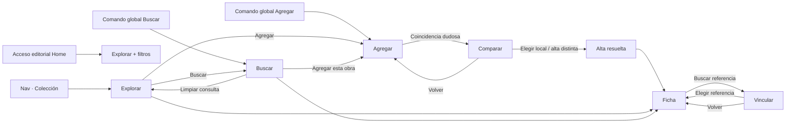

# U3.1 — Wireflow y contrato de estados de Colección

Este documento traduce el brief U3.1 a estados observables. No prescribe píxeles ni
implementa componentes.

## Mapa de entrada y resolución



## Anatomía por modo

```text
EXPLORAR
┌ Colección ─── [Explorar] [Buscar] [Agregar] ─────────────┐
│ Estado · Disponibilidad · Tipo       [Más filtros]        │
│ Chips activos · N resultados                  Orden       │
├───────────────────────────────────────────────────────────┤
│ Grilla material de cajas                                 │
└───────────────────────────────────────────────────────────┘

BUSCAR
┌ Colección ─── [Explorar] [Buscar] [Agregar] ─────────────┐
│ [Consulta local________________________________] [Buscar] │
│ Estado · Disponibilidad · Tipo       [Más filtros]        │
│ Chips activos · N resultados                  Orden       │
├───────────────────────────────────────────────────────────┤
│ La misma grilla local, filtrada por consulta             │
├ Ampliar a fuentes externas ───────────────────────────────┤
│ Resultados externos por fuente, con procedencia          │
└───────────────────────────────────────────────────────────┘

AGREGAR
┌ Colección ─── [Explorar] [Buscar] [Agregar] ─────────────┐
│ [Obra para agregar_____________________________] [Buscar] │
│ Coincidencias en tu catálogo · resguardo de duplicados   │
├ Fuentes externas ─────────────────────────────────────────┤
│ Resultados por fuente · Agregar / Revisar coincidencia   │
└───────────────────────────────────────────────────────────┘

COMPARAR / VINCULAR
┌ Resolver coincidencia ─────────────────────────── [Volver]┐
│ ANCLA fija: obra externa (comparar) o local (vincular)    │
│ [Buscar sólo el lado opuesto___________________] [Buscar] │
├───────────────────────────────────────────────────────────┤
│ Candidatos del lado opuesto · decisión explícita         │
└───────────────────────────────────────────────────────────┘
```

En móvil se conserva este orden vertical. La cabecera de tarea y la obra ancla quedan
antes de controles/resultados; no se usa un carril horizontal que oculte filtros sin
señal, y la navegación inferior no tapa acciones finales.

## Contrato de estado

| Eje | Valores | Regla |
| --- | --- | --- |
| `mode` | `browse`, `search`, `add`, `compare`, `link` | Es visible en copy y jerarquía; sólo cambia por una acción explícita. |
| `phase` | `idle`, `loading`, `ready`, `empty`, `partial`, `error`, `success` | Describe el trabajo del modo sin reemplazarlo. |
| `q` | cadena normalizada para UI, texto original conservado | Menos de 2 caracteres valida en contexto; no borra anclas. |
| `filters` | estado, disponibilidad, tipo, fuente, década, género, dirección, memoria, estreno | Unión dentro de una faceta e intersección entre facetas. Sólo browse/search. |
| `year` | desde/hasta | Misma faceta temporal que década; reglas existentes de unión se conservan. |
| `sort` | original, título, año, puntaje, agregado | Persistente y enlazable en browse/search. |
| `external` | apagado, encendido, no disponible | En search amplía; en add/link es requisito de tarea y se explica si falta. |
| `anchor` | ninguna, obra externa, obra local | Obligatoria en compare/link; siempre visible y estable al refinar `q`. |
| `capabilities` | `can_read`, `can_write`, `can_force_add`, fuentes disponibles | Gobierna acciones; no se deduce visualmente del rol owner/miembro. |
| `returnPoint` | modo, URL, scroll, foco, cantidad visible | Se guarda en `history.state`, no como parámetros decorativos. |

## Contrato de URL e historial

La URL canónica mantiene `view=catalog`. `mode=browse` se omite; los otros modos lo
declaran. Se conservan los parámetros existentes `q`, facetas repetibles, rango de año,
`sort`, `duplicates`, `external` y `director` cuando son relevantes.

- `mode=search`: admite consulta, filtros, orden y ampliación externa.
- `mode=add`: admite consulta y fuente; elimina filtros de estantería irrelevantes.
- `mode=compare`: exige `candidate_source` + `candidate_ref`, una referencia opaca y
  estable derivada del identificador canónico o URL normalizada de la fuente.
- `mode=link`: exige `link_id` local y admite fuente externa.
- `movie`: sigue abriendo la ficha sin destruir el estado subyacente.

La instantánea completa del candidato externo vive también en `history.state` para una
vuelta inmediata. En recarga o enlace compartido se reconsulta `q` y se recupera por
`candidate_source/candidate_ref`. Si no aparece, se conserva `mode=compare`, se muestra
«La referencia elegida ya no está disponible» y se ofrece volver a Agregar/Buscar.

`history.state` conserva además `scrollY`, `visibleCount`, el elemento del control que abrió
la ficha y la semilla/orden mezclado mientras esa entrada exista. Un `popstate` restaura
primero el modo y los datos, después renderiza, y finalmente repone scroll/foco.

## Matriz de comportamiento

| Evento | browse | search | add | compare | link |
| --- | --- | --- | --- | --- | --- |
| Enviar consulta | entra en search | refina grilla local | consulta externas + duplicados | refina sólo local | refina sólo externas |
| Cambiar filtro | actualiza grilla | actualiza grilla buscada | no se muestra | no se muestra | no se muestra |
| Limpiar consulta | permanece browse | vuelve a browse y conserva filtros | permanece add vacío | valida, conserva ancla | valida, conserva ancla |
| Elegir resultado local | abre ficha | abre ficha | advierte existente | resuelve comparación | no aplica |
| Elegir resultado externo | no aplica | ofrece agregar/vincular | agrega o compara | ancla ya fija | vincula |
| Atrás | restaura origen | restaura estado previo | restaura estado previo | vuelve a add/search | vuelve a ficha |

## Vacíos, errores y permisos

- **Catálogo vacío:** una bienvenida compacta explica la diferencia entre disponibilidad
  y pendiente; CTA principal `Agregar una obra`, secundaria `Importar desde Bandeja`.
- **Filtros sin resultados:** conserva controles y chips; ofrece quitar el último filtro
  o limpiar todos. No ofrece una alta externa si no hay consulta.
- **Consulta local vacía:** ofrece `Ampliar a fuentes externas` o pasar a Agregar con la
  misma consulta.
- **Fuentes parciales:** resultados exitosos permanecen; cada fuente fallida conserva
  procedencia, razón, reintento y fallback honesto.
- **Sin escritura:** la exploración y el detalle siguen operables; selector Agregar y
  acciones mutantes quedan deshabilitados con explicación persistente. Nunca se deja
  que la API sea el primer lugar donde la persona descubre el permiso.
- **Error de restauración:** conserva el modo y ofrece recuperación contextual; no borra
  query/filtros ni vuelve silenciosamente a la raíz.

## Criterio de aceptación para U3.2/U3.3

Una prueba debe recorrer cada flecha del wireflow y afirmar modo visible, URL, ancla,
foco y resultado. Los viewports 320/390 no pueden requerir scroll horizontal ni ocultar
el selector de tarea, los chips o la acción de salida. En escritorio, la entrada y los
controles no deben ocupar más protagonismo vertical que la primera fila de cajas salvo
durante comparar/vincular.
