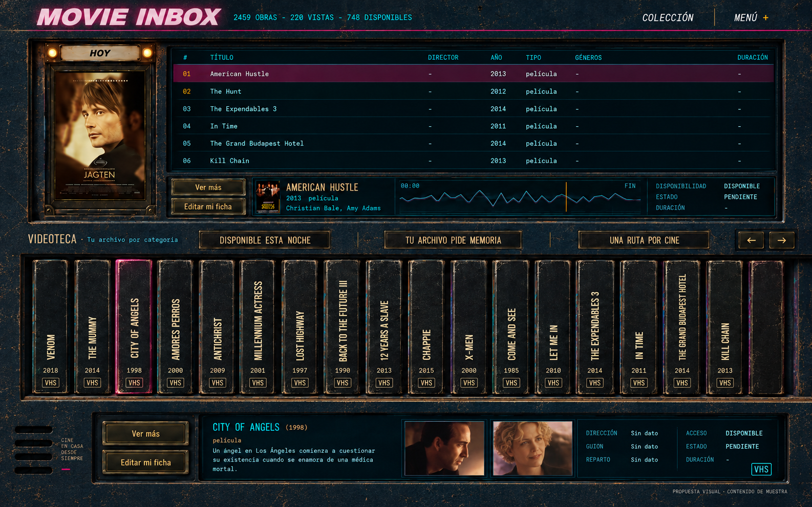

# U4.2 — Plan de videoteca empotrada en un material continuo

2026-09-12. **U4.2a/b aprobadas; U4.2c y U4.2d.1–d.3 integradas y aceptadas visualmente; base U4.2 cerrada.**
El owner pidió desarrollar la alternativa empotrada con la imagen que volvió a adjuntar.
Esa imagen es la referencia de composición/material, no la C suavizada por defecto.

## Intención y resultado

Home web de escritorio, modo Operate. La persona recorre su programación y biblioteca,
selecciona obras y consulta su ficha sin que el tratamiento material dificulte leer o
actuar. La escena es una superficie pintada continua en la que se abren cartelera,
estante y consola. No hay una carcasa independiente colocada delante de un fondo.

## Construcción propuesta

- **Un plano frontal continuo.** El mismo material azul-negro ocupa los márgenes del
  viewport y los espacios entre huecos. Su grano mantiene escala y continuidad; la luz
  general pertenece a la escena, no se reinicia por panel. Los contenedores funcionales
  no agregan otro fondo exterior. La textura repetible, si se usa, repite sólo material
  sin motivos reconocibles: nunca estantes, remates, tornillos o una captura de la Home.
- **Profundidad hacia adentro.** Cada abertura añade un labio fino, bisel, espesor oscuro
  y sombra interna. El frente alrededor del hueco deja visible el material común. El
  canto interior puede recibir luz y desgaste distintos porque cambia de plano: lo que
  debe desaparecer es el contorno rectangular de un asset pegado, no la abertura.
- **Kit material, no imagen de pantalla completa.** Preparar textura base sin texto ni
  iluminación horneada de extremo a extremo; bordes y esquinas de aberturas con exterior
  transparente en composición; labio/base del estante; tratamiento compatible para placas y marco HOY.
  Usar assets raster donde aporten acabado y geometría/CSS para ensamblar y adaptar.
  Los biseles no se estiran completos hasta deformar esquinas o cambiar su espesor.
- **Contenido conservado y vivo.** Póster, tabla, señal, controles, títulos de VHS,
  imágenes y fichas siguen siendo componentes de la aplicación. Sin nueva tipografía,
  lógica ni funciones. Conservar fuentes/jornada HOY–AYER, acceso lateral, conteos y
  estados aunque el concepto los omita. No copiar el eslogan o los datos inventados de
  la imagen. Las rejillas pueden vivir en la superficie inferior sin columna autónoma;
  sólo conservar las leyendas ya aprobadas.
- **Desgaste y legibilidad.** Tomar el carácter del material de la imagen adjunta y
  calibrar su intensidad en una muestra a tamaño real. No alisar todo por anticipado ni
  extender manchas de alto contraste detrás de texto pequeño. Texto, foco y selección
  no heredan filtros, opacidad o máscaras de la capa decorativa.

## Etapas y entregables

| Etapa | Entrega | Comprobación para avanzar |
| --- | --- | --- |
| U4.2a — Material y kit de muestra | Superficie continua y muestra de esquina, canto y placa; tono y desgaste comparados con esta referencia | El material de fuera y entre módulos se lee como un mismo plano, sin mosaico visible ni fondo exterior horneado |
| U4.2b — Encuentro representativo | Prueba aislada a tamaño real del póster, esquina de playlist y arranque del estante, con texto y controles reales | Profundidad convincente y ninguna placa o pantalla flotante; revisión del owner antes de extender |
| U4.2c — Base Home continua | Llevar el material y las aberturas aprobadas a la estructura de Home, manteniendo los componentes actuales | Continuidad en 1280, 1440 y 1920 px; U4.2 sólo se cierra tras revisión visual |
| U4.2d.1 → d.2 → d.3 | Reencuadre centrado, selección compartida y consolidación en una consola superior | Comparación visual primero; integración sin perder contenido ni alterar programación |
| U4.3 → U4.4 | Ajustar consola única y placas/VHS dentro del sistema probado; U4.5 absorbida en d.3/U4.3 | Misma escala de cantos, grano, sombras y apoyos; no convertir avances parciales en cierres de las otras tareas |
| U4.6 | Comparación completa desktop y smoke móvil | Integración estética y comportamiento verificados por separado |

La primera entrega prioriza dirección visual y assets. La prueba de ensamblaje requiere
código acotado, que puede recibir el agente de implementación con este brief y el kit;
esta planificación no ejecuta ni delega esa implementación.

## Prueba de continuidad y rangos

- Revisar a 1280×720, 1440×900 y 1920×1080, al 100 % y con detalle ampliado de las uniones.
  Los márgenes adicionales del viewport muestran el mismo material; no aparece una
  silueta de mueble al ampliar la ventana ni una costura al desplazar verticalmente.
- El estante conserva la continuidad lateral aprobada hacia el borde derecho: sin
  poste terminal, franja vacía usada como remate o sobreancho fijo calculado para un
  solo viewport. Esto es independiente de compartir textura con el resto de la página.
- Probar una Home poblada, categorías escasas/vacías, títulos largos en español,
  metadata o imágenes faltantes y cambio de selección/categoría. Los huecos se adaptan
  al contenido; no dependen de las coordenadas del texto en la imagen de referencia.
- Comprobar navegación por teclado y foco sin recortes. Las capas materiales son
  decorativas y no interceptan clics. No alterar otras vistas al cambiar el fondo Home.
- Móvil recibe únicamente una comprobación de reflow y ausencia de overflow de página;
  la composición nativa vertical futura no se diseña en este frente.

## Arranque y decisión técnica

El owner autorizó arrancar si la base tecnológica actual era suficiente. La revisión de
`pyproject.toml`, `static/app.js`, `static/style.css` y `routers/home.py` confirma la
separación existente: Python/FastAPI para datos y APIs; módulos JavaScript, HTML y CSS
para la interfaz. U4 no requiere sumar un framework ni migrar lógica a JavaScript.
La continuidad y la profundidad se construyen con assets coherentes y CSS; la
interacción existente sigue en JS. El laboratorio de U4.2a sólo usa JS para calibración.

La muestra vive en `docs/design/u4-2a-material-kit-v1/`. El owner aprobó pintura, desgaste
y canto el 2026-09-10. La entrega se resolvió como kit compuesto CSS + fuentes RGB:
la transparencia del exterior pertenece a la composición, no a los PNG originales.
`material-components.css` encapsula las coordenadas; no consumir borde/placa en crudo.

U4.2b vive en `docs/design/u4-2b-integrated-junction-v1/`, con HTML y renderers actuales
de Home y datos de demostración aislados. El owner aprobó el encuentro y pidió ampliar
la playlist: seis filas completas sin scroll interno en desktop.

U4.2c aplica el material y los huecos en producción con dos CSS dedicados, sin apilar
los imports de la carcasa rechazada. Las reglas compartidas de ficha/admin se conservan
en sus respectivas superficies. No cambia la lógica de Home ni se agrega un framework.
Evidencia y reproducción con aplicación real/datos desechables:
`docs/design/u4-2c-evidence/README.md`.

## Reencuadre solicitado después de c

El owner pidió eliminar la duplicación del panel inferior, hacer que la consola
superior responda a la selección del estante y revisar la salida sólo a la derecha.
Se intercala **U4.2d** antes de U4.3. La continuidad del material sigue aprobada;
la continuidad geométrica unilateral deja de ser un requisito del nuevo encuadre.

**d.1** presenta `docs/design/u4-2d-1-composition/`: comparador con los mismos
componentes, máximo 2240 px centrados y estante contenido entre dos cantos finos.
Una sola consola visible; altura de VHS y seis filas intactas. No aplicado a Home.
**d.2** conecta la selección sin reprogramar la playlist ni permitir que autoplay
pise la selección manual. **d.3** lleva la composición a producción, consolida
información/acciones y retira el panel inferior. U4.3 integra visualmente esa
consola definitiva; U4.5 se absorbe en d.3/U4.3. U4.4 y el gate U4.6 siguen pendientes.

**Actualización 2026-09-11:** d.2 implementada en el JS de Home y comprobada con
6 pruebas JS, 20 Python y navegador conectado. Origen + clave separan la consulta
de la programación; Club conserva sus acciones. El comparador d.1 usa esa lógica.
En ese corte todavía permanecía el componente inferior de producción.
Detalle: `docs/design/u4-2d-2-selection.md`.

**Actualización posterior, d.3:** encuadre integrado en Home y host/renderizador
inferiores retirados. La consola superior conserva el contexto de origen y todas
las acciones útiles, con sinopsis, dos imágenes, créditos y estado; sustituye onda
decorativa y miniportada. Ocho pruebas JS y veinte Python aprobadas, más verificación
conectada de ficha/edición, Club, navegación, vacío, imágenes faltantes y reflujo.
Aceptación visual recibida el 2026-09-12. Sigue U4.3; no se adelanta el cierre general de U4.
Evidencia: `docs/design/u4-2d-3-evidence/README.md`.
