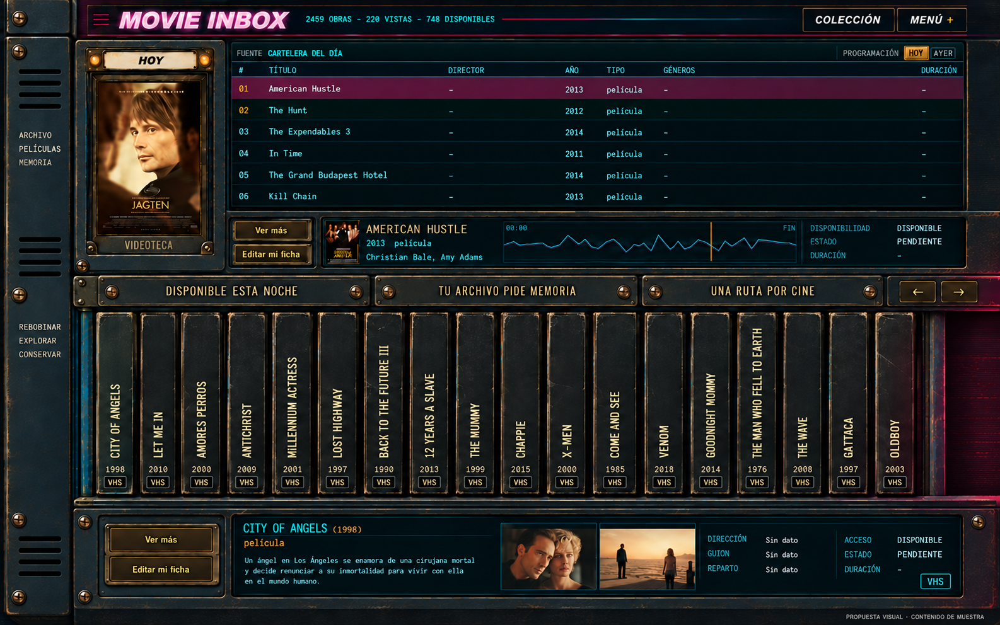
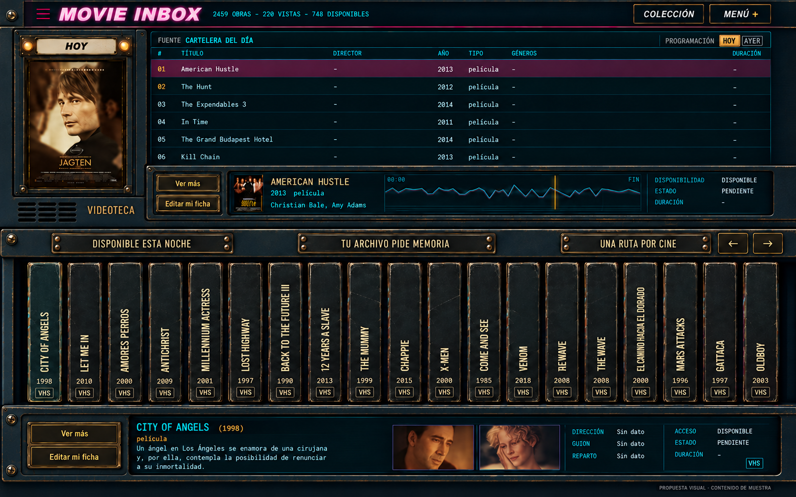
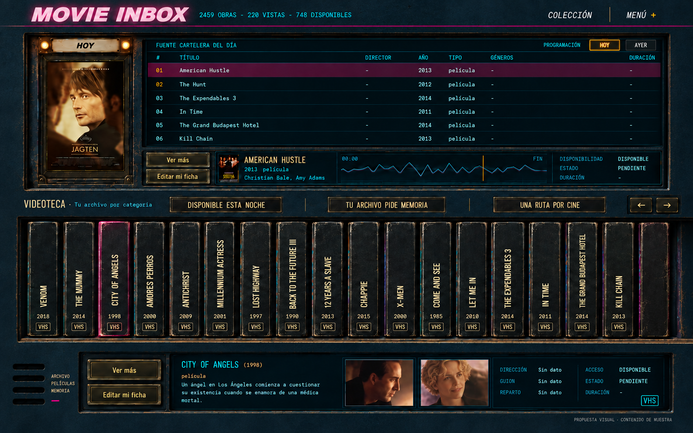

# U4.2 — Nueva comparación de composición y materiales

2026-09-09. **Comparación realizada; enfoque empotrado elegido para planificar.** Las dos
bases implementadas fueron rechazadas. Esta entrega no cambia la Home ni cierra U4.2.
El owner volvió a aportar su [referencia empotrada](owner-reference-inset-library.png),
con más desgaste que la C suavizada. Ver el [plan actual](../u4-2-inset-library-plan.md);
las tres alternativas siguientes se conservan como historial de la comparación.

## Qué cambió en la revisión

Se volvió a inspeccionar la opción B elegida, el north star U2, el kit de assets y las
capturas de ambas implementaciones. El problema no es simplemente «mucho raster» o
«poco CSS»: faltan encuentros con espesor y soportes compartidos; se mezclan materiales
y algunos controles siguen colocados sobre huecos que ya no existen. Ver el
[diagnóstico por pieza](asset-review.md).

Las propuestas mantienen el vocabulario VHS, títulos verticales ascendentes, tipografía
condensada recta, datos monoespaciados, papel crema, metal pintado y displays oscuros.
Cambian la estructura que une esas piezas. Se muestra el conjunto poblado para evaluar
cartelera, estante, controles y fondo a la vez.

## A — B reconstruida

Es la más cercana a la B elegida en U4.1. El lateral técnico, el marco del póster y el
frente del estante tienen encuentros comunes. Las rejillas y las leyendas aprobadas
permanecen en el lateral, que tiene función estructural visible.

- Fortaleza: conserva la identidad y la profundidad de la referencia elegida.
- Riesgo: exige resolver muy bien las uniones; una columna decorativa independiente
  reproduciría el problema anterior. Es la opción de mayor presencia material.
- Kit a estudiar: retorno lateral, unión con marco del póster, travesaños y biseles;
  todas las piezas bajo una misma iluminación y escala de desgaste.

## B — Carcasa horizontal

Elimina la columna alta. Cartelera y estantería comparten un cuerpo ancho con travesaños
claros. Las ventilaciones pasan al soporte horizontal bajo el póster y los controles
inferiores quedan dentro del frente del mueble.

- Fortaleza: conserva el carácter de consola con menos encuentros conflictivos y más
  espacio útil. Placas, botones y pantallas tienen superficies de montaje identificables.
- Riesgo: los travesaños necesitan espesor real y continuidad; no pueden convertirse
  otra vez en franjas lisas entre assets muy texturados.
- Kit a estudiar: retornos cortos, fascia horizontal, labios de estante, marcos de
  display y una superficie pintada común con desgaste localizado.

## C — Videoteca empotrada

Fondo y soporte son la misma superficie. Cartelera, estante y ficha se abren como
cavidades en ella. No hay una carcasa completa recortada delante de otro fondo ni una
columna lateral independiente.

- Fortaleza: cambia de raíz la relación fondo/mueble que el owner rechazó y permite
  bajar el ruido visual en superficies grandes sin perder profundidad en los bordes.
- Riesgo: se aleja más de la B original; necesita conservar suficientes labios, sombras
  internas y materialidad del VHS para no parecer un dashboard plano.
- Kit a estudiar: material base continuo y aperturas segmentadas; luz concentrada en
  los huecos, sin una silueta opaca gigante superpuesta.

## Qué se está eligiendo

Se elige **la composición y la relación entre materiales**, no cada píxel ni el contenido
factual de estas imágenes. Son propuestas generadas con contenido de muestra: los
textos, títulos, pósteres y fotogramas pueden tener imprecisiones y no sustituyen los
datos de la aplicación. Tampoco demuestran funcionamiento, accesibilidad o responsive.

La generación también simplificó detalles de UI: faltan conteos de categorías y algunos
encuentros del extremo derecho todavía sugieren un remate. No son cambios de requisitos:
los conteos se conservan y la continuidad real del estante sigue siendo obligatoria en
la prueba con componentes. No se aceptarán esos recortes como solución de producción.
La C también omite el acceso lateral del encabezado: debe conservarse en la UI real.

Los controles y textos de producción seguirán siendo HTML. Ninguna imagen completa se
usará como fondo de pantalla detrás de controles posicionados por aproximación. La
dirección elegida necesita un kit sin texto ni contenido de películas y una prueba
ensamblada con los componentes reales antes de darse por integrada.

## Próximo paso y aceptación

1. Elegir A, B o C, indicando si se desea combinar un detalle puntual.
2. Probar material base y un encuentro representativo (póster/travesaño/estante) con
   contenido real. Compararlo con la dirección elegida antes de extender el kit.
3. Resolver U4.2 en 1280, 1440 y 1920 px, incluida la continuidad hasta el borde derecho.
4. Continuar U4.3, U4.4 y U4.5 con esta construcción común. La aprobación de una propuesta
   no cierra automáticamente ninguna de esas integraciones.

Los [prompts iniciales](prompts.json) y [ajustes de acabado](refinements.json) conservan
la trazabilidad. Las imágenes son alternativas conceptuales, no capturas del navegador.
