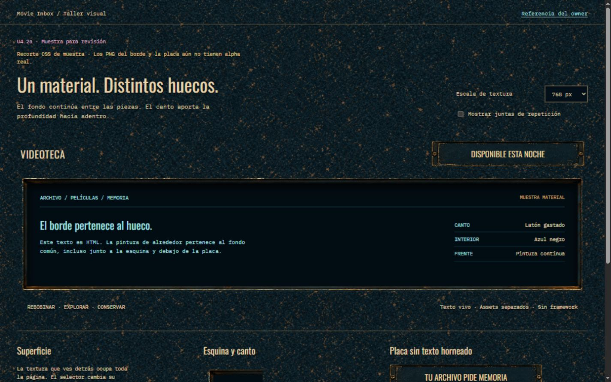

# U4.2a — Muestra de material y piezas

2026-09-10. **Acabado aprobado por el owner y entrega técnica cerrada como kit compuesto
CSS + fuentes RGB.** No es un kit de PNG con alpha. U4.2b continúa en su propio laboratorio;
la Home de producción no se modifica por esta entrega.



## Decisión técnica

La base existente alcanza para este enfoque: `pyproject.toml` declara FastAPI/Uvicorn;
`src/movie_inbox/web/routers/home.py` entrega datos; `static/app.js` carga módulos JS y
`static/style.css` organiza estilos por superficie. Python no está dibujando la carcasa.
No hace falta migrar lógica a JavaScript ni introducir un framework para U4.

El trabajo visual corresponde a HTML/CSS y assets coherentes; JS mantiene las
interacciones. CSS admite [fondos por capas](https://developer.mozilla.org/en-US/docs/Web/CSS/Guides/Backgrounds_and_borders/Using_multiple_backgrounds)
y [bordes segmentados](https://developer.mozilla.org/en-US/docs/Web/CSS/Reference/Properties/border-image-slice).
El laboratorio usa únicamente JS para el selector de escala y las guías. Su servidor
de preview usa Node estándar, sin paquetes nuevos; no reemplaza al backend Python.
Al integrar, consolidar las reglas visuales obsoletas de Home en lugar de acumular
otra cadena de overrides. Una migración de framework no forma parte de este frente.

## Entrega y estado real

| Archivo | Uso y estado |
| --- | --- |
| `surface-petroleum-v2.png` | Textura opaca activa, 1254×1254; desgaste más distribuido tras revisión |
| `surface-petroleum-v1.png` | Primera textura, conservada como comparación; sus agrupaciones diagonales se repetían demasiado |
| `aperture-bezel-v1.png` | Fuente RGB, 1254×1254; canto y sombra interior útiles, pero tiene un damero dibujado en el exterior y centro |
| `category-plaque-blank-v1.png` | Fuente RGB, 2172×724; centro sin texto, dos tornillos, exterior con damero dibujado |
| `index.html`, `material-lab.css`, `material-lab.js` | Muestra aislada: material común, hueco, esquina y placas con texto HTML y fuentes locales aprobadas |
| `material-components.css` | API visual reutilizable: `.u4-plane`, `.u4-aperture`, `.u4-plate`; composición probada con contenido real en U4.2b |
| `sample-1280.png`, `sample-1440.png`, `sample-1920.png`, `sample-390.png` | Capturas de la muestra; no son evidencia de integración Home |

Se usó Imagegen integrado. [Prompts iniciales](prompts.json),
[intentos de extracción alpha](alpha-refinements.json) y
[ajuste de textura](surface-refinement.json) quedan versionados.

**Limitación comprobada:** tanto la generación inicial como el intento de corrección
entregaron imágenes RGB. La inspección leyó `Format24bppRgb`; los píxeles exteriores
y centrales tenían alpha 255. Un damero dibujado no es transparencia. No se convirtieron
archivos ni se fingió una exportación alpha.

La muestra utiliza la parte útil de las fuentes mediante geometría CSS: `border-image`
sin relleno y `clip-path` en el bisel; ventana de background para la placa. El texto
continúa vivo y el plano común se ve alrededor. El recorte está calibrado para esas
fuentes: no copiarlo a otro asset esperando que coincida. Si cambia el kit hay que
revisar sus coordenadas, radios y antialiasing. Se eligió la entrega compuesta permitida
por el plan, conservando el acabado aprobado. Una futura distribución de PNG independientes
sí requeriría exportarlos con alpha; **no consumir estos dos PNG directamente como fondos de panel**.

## Contrato del kit compuesto

Mantener `material-components.css` junto a los tres PNG activos y cargarlo una vez.
Aplicar `.u4-plane` sólo al plano frontal común (por ejemplo, body del laboratorio),
nunca a cada módulo. Tamaño de textura por defecto: 768 px; variable `--u4-texture-size`.
`.u4-aperture` reserva 24 px de canto alrededor del contenido; sus dos pseudoelementos
son decorativos, sin captura de eventos. No reutilizar esos pseudoelementos para contenido.
`.u4-plate` sirve de soporte al texto HTML de la placa, con ancho de referencia 360 px.

El borde usa corte 125 / ancho 40 px, exterior -16 px y máscara inset 28 px. El centro
es un pozo CSS independiente. La placa usa una ventana de background 103.6% × 214%.
Estos valores son internos al kit: no escalarlos para cada viewport ni sustituir las
fuentes sin recalibrar. Las cajas de clipping pueden contar para overflow de layout:
en el smoke móvil U4.2b se contiene sólo el root de la muestra, dejando el foco dentro
del margen; desktop conserva la salida derecha del estante.

## Revisión aplicada

La revisión independiente de Impeccable encontró tres ajustes: constelaciones de
desgaste reconocibles, texto pequeño sobre manchas brillantes y la advertencia RGB
fuera del primer viewport. Se preparó la textura v2, se aumentó el texto exterior y
su separación mediante sombra corta, y se llevó la limitación a la cabecera.

La inspección final del laboratorio no mostró fragmentos del damero en el hueco ni
en las placas. Conserva el borde fino de latón y el interior azul-negro. Esto no prueba
todavía la unión con póster, playlist o VHS reales. La textura es una candidata visual
de repetición: no se certifica coincidencia matemática perfecta de sus bordes ni se
consideró aprobada su densidad de desgaste hasta la confirmación del owner del 2026-09-10.

## Comprobaciones

- JS y servidor: `node --check`, sin errores.
- Navegador: fuentes locales cargadas; selector cambia el tamaño de fondo entre
  512/768/1024 px; guías de repetición se activan y desactivan.
- Geometría de muestra: sin overflow horizontal en 1280×720, 1440×900, 1920×1080 y
  390×844. El scrollbar vertical se descuenta al medir `clientWidth`.
- Inspección visual desktop y smoke móvil con captura tras recargar en cada ancho.
  Las capturas son de viewport, no mosaicos de página completa.
- No se ejecutaron tests de backend: no hay cambios de lógica ni rutas de producción.

## Abrir la muestra

Desde la raíz del repo:

```powershell
node docs/design/u4-2a-material-kit-v1/serve-preview.mjs
```

El comando imprime una URL local con puerto libre. Sirve solamente los archivos
explícitos de la muestra y sus dos fuentes, en `127.0.0.1`; no expone APIs ni catálogo.
La página permite cambiar la escala, marcar juntas y desplegar la referencia del owner.

## Siguiente paso

El acabado ya está aprobado y el kit compuesto entregado. U4.2b prueba el encuentro
póster/playlist/arranque del estante con componentes reales en
`../u4-2b-integrated-junction-v1/`; U4.2c extiende la base después de esa revisión.
El [plan general](../u4-2-inset-library-plan.md) conserva los gates de cada etapa.
