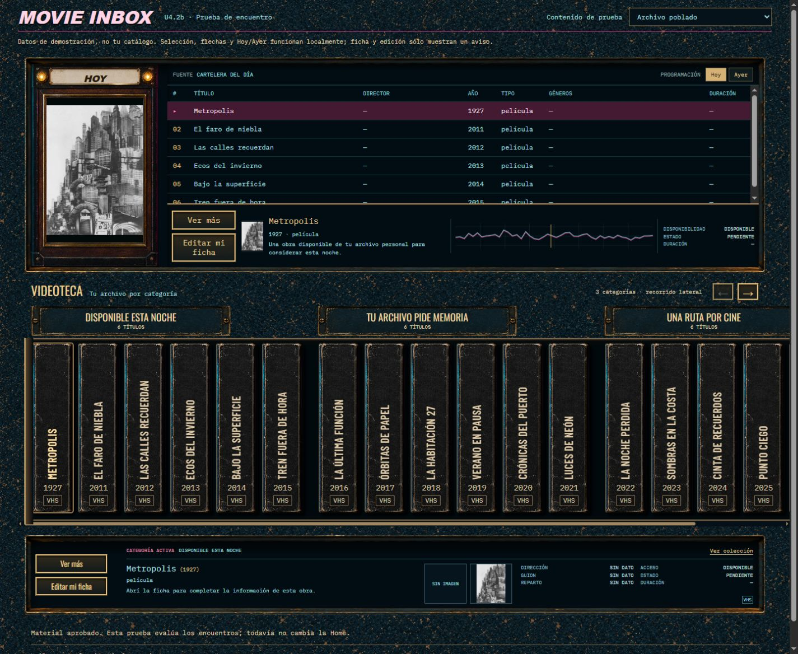

# U4.2b — Encuentro empotrado

2026-09-10. **Encuentro aprobado por el owner.** Solicitó ampliar la playlist Winamp
para ver sus seis filas sin scroll interno. Ese ajuste se aplica en U4.2c junto con
la integración en Home; no equivale a cerrar U4 completa. Sin commit.



## Qué se prueba

Un frente de pintura petróleo continuo, con el hueco de la cartelera, el apoyo del
marco HOY, el travesaño de placas y el comienzo del estante. El canto del estante
arranca a la izquierda; el recorrido queda abierto hasta el borde derecho del viewport.
No hay otra textura detrás del aparato ni una columna decorativa separada.

Se importa `static/index.home.html` y `static/js/surfaces/home.js` **sin copiarlos ni
modificarlos**. El renderer genera póster, playlist, señal, placas, lomos y ficha breve.
Las fuentes y los assets de póster/lomos son los existentes. El CSS de este laboratorio
es un adaptador aislado, no una nueva capa de overrides en producción. El kit reusable
vive en `../u4-2a-material-kit-v1/material-components.css`.

La consola inferior se muestra para dar contexto al apoyo del estante. No se consideran
terminados sus botones, densidad o tratamiento de imágenes: U4.3–U4.5 conservan su alcance.
No se elimina navegación, conteos o menús de la aplicación; la cabecera de laboratorio
no es una propuesta de reemplazo para la cabecera de Home.

## Interacción y aislamiento

- Seleccionar una fila cambia su ficha superior sin mover póster ni selección inferior.
- Seleccionar un lomo cambia sólo la selección del estante. Las flechas de teclado
  usan los handlers reales de Home; activar una categoría cambia la fuente de playlist.
- Hoy/Ayer carga instantáneas sintéticas en memoria. No se consulta el historial real.
- Las flechas laterales recorren categorías cuando existe overflow. El fondo y los
  labios permanecen fijos mientras los lomos se desplazan.
- «Ver más», edición y navegación exterior sólo muestran un aviso explícito. El
  laboratorio no implementa esos flujos ni carga el dispatcher de producción.
- Sin autoplay durante la inspección. No representa un cambio a la rotación de Home.
- Modos: archivo poblado, una categoría con títulos largos, imágenes ausentes y vacío.

El servidor Node usa sólo módulos estándar, escucha en loopback, sirve archivos públicos
con rutas enumeradas y rechaza métodos distintos de GET/HEAD. No expone APIs, catálogo,
bases, rutas privadas ni un proxy de red. El endpoint de imagen sólo acepta la clave
de la portada de demostración. No se añadió un framework ni lógica al backend.

## Contenido de demostración

Dieciocho fichas, sus agrupaciones y todos los estados personales son una fixture de
diseño, no el catálogo del owner. Diecisiete títulos son sintéticos. Metropolis y su
año se corresponden con la portada usada; créditos y duración desconocidos se omiten.

`metropolis-poster.jpg` se descarga sin edición de la
[fuente de Wikimedia Commons](https://commons.wikimedia.org/wiki/File:Boris_Bilinski_-_Filmplakat_f%C3%BCr_Metropolis.jpg):
cartel de Boris Bilinsky, 1927, 800×1074, identificado allí como dominio público.
La procedencia también se muestra dentro del laboratorio. No se tomaron portadas ni
fichas del catálogo privado.

## Revisión visual aplicada

La revisión independiente de Impeccable pidió dos correcciones materiales: un retorno
izquierdo del estante unido a ambos labios, y llevar el marco HOY hasta el basamento
de la playlist. Ambas se aplicaron. La imagen del marco mantiene su proporción al
escalar por altura; el contenido del display no puede expandir el track del hueco.
El material v2 aprobado no fue regenerado ni suavizado.

## Comprobación y límites

- Evidencia de viewport: 1280×720, 1440×900, 1920×1080; overview 1440×1180 para mostrar
  los apoyos completos. No se comprime todo para fingir que cabe en 720 px de alto.
- Smoke móvil 390×844: reflow y contención horizontal, no diseño nativo ni gate móvil completo.
- En escritorio la derecha del estante coincide con `documentElement.clientWidth`,
  incluso con Home limitada a 1680 px y margen de 112.5 px en viewport de 1920.
- El kit sigue siendo CSS + fuentes RGB. Ningún archivo de canto/placa se presenta
  como PNG alpha independiente. Inspección de los recortes a tamaños de muestra.
- Selecciones, jornada, teclado, archivo vacío e imágenes ausentes se verifican en
  navegador. No reemplaza los tests de regresión del producto al implementar U4.2c.
- Resultado numérico y pruebas de aislamiento: `browser-checks.json`. Sin errores de
  consola en la pasada final; revisión independiente de los dos apoyos aprobada.

## Abrir

Desde la raíz del repo:

```powershell
node docs/design/u4-2b-integrated-junction-v1/serve-preview.mjs
```

Abrir la URL local que imprime. Encuentro aprobado; la integración y el aumento de
escala se documentan en `../u4-2c-evidence/`. Después siguen U4.3–U4.6.
