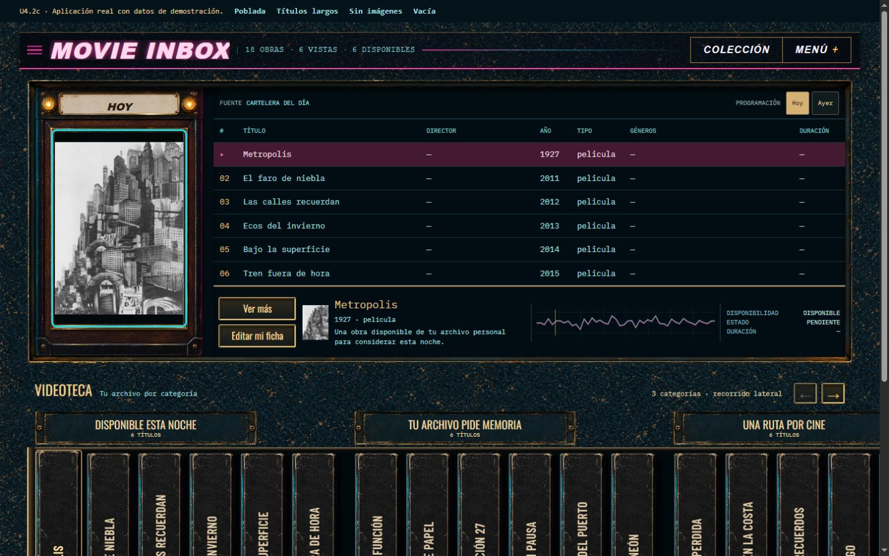
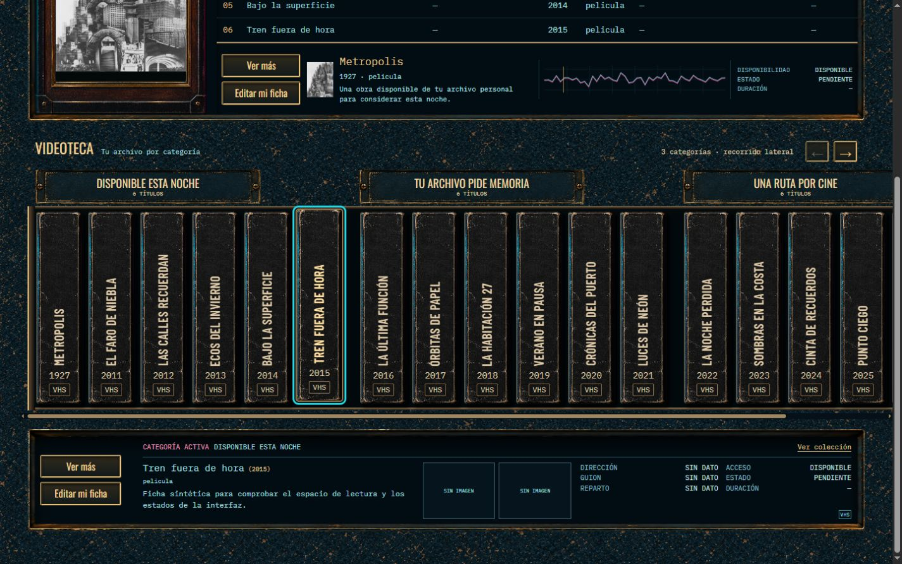

# U4.2c — Base Home continua

2026-09-10. **Implementación terminada; aceptación visual del owner pendiente.**
U4.2b aprobada. No se cierra U4 completa ni se inicia U4.3. Sin commit solicitado.





## Entrega

- Material petróleo v2 dibujado una vez en el fondo de Home. Póster, playlist,
  estante y consola comparten ese frente con aberturas hacia adentro.
- `home-inset.css` reemplaza la composición de la antigua carcasa; `home-material.css`
  encapsula los recortes del kit aprobado. Los CSS históricos permanecen en el repo,
  pero ya no se importan en la aplicación. No se apilan ambas reconstrucciones.
- Playlist ampliada: seis filas de al menos 38 px, texto de 13 px y altura natural.
  El scroll de la página es intencional; no se encoge toda la Home para caber en 720p.
- Retorno izquierdo y piso vinculados a la altura del VHS; borde derecho continuo
  hasta el viewport. Placas Oswald 400, lomos Barlow Condensed y datos IBM Plex Mono.
- Sin cambios nuevos a JS, APIs, datos, permisos ni dependencias. Las reglas compartidas
  de ficha/admin antes incluidas en `home.css` se conservaron en sus propias hojas.

El kit son **fuentes RGB + CSS calibrado**, no exports alpha. Los tres PNG aprobados
se copiaron sin edición a `static/img/`; el borde y la placa no deben consumirse en crudo.

## Verificación

Aplicación FastAPI real, dispatcher y renderers reales, cuenta local y catálogo
desechables. El servidor de revisión reemplaza solamente las respuestas editoriales
con una fixture; los flujos de ficha y navegación usan la aplicación existente.

| Viewport | Ancho útil / página | Tabla visible / contenido | Filas | Borde derecho estante |
| --- | --- | --- | --- | --- |
| 1280×720 | 1265 / 1265 | 863×270 / 863×270 | 6 | 1265 |
| 1440×900 | 1425 / 1425 | 1023×270 / 1023×270 | 6 | 1425 |
| 1920×1080 | 1905 / 1905 | 1342×270 / 1342×270 | 6 | 1905 |

Sin scroll interno de tabla en los tres anchos. El póster y la playlist terminan
en la misma coordenada vertical. La scrollbar vertical de página explica los 15 px
de diferencia entre viewport y ancho útil.

Comprobado en navegador:

- Selecciones superior/inferior independientes; flechas e Inicio/Fin en controles.
- Desplazamiento lateral de categorías, Hoy/Ayer y sus estados visibles.
- «Ver más» abre la contratapa; «Editar mi ficha» abre el editor, cerrado sin guardar.
- Colección abre correctamente y recupera su fondo habitual, fuera del CSS de Home.
- Categoría única con dos títulos largos, imágenes ausentes y editorial vacía.
- Smoke a 390 y 320 px: sin overflow horizontal de página; ficha debajo de la categoría
  activa, datos reordenados. Tabla y lomos conservan scroll local en móvil.
- Sin errores de consola en la pasada funcional. No se modifica el catálogo del owner.

Tests ejecutados: `tests.test_package_layout`, `tests.test_home_service` y
`tests.test_home_snapshot_repository`: **20/20 OK**. Packaging comprueba los tres PNG
nuevos y ambas hojas de estilo.

La suite completa de navegador **no fue ejecutada**: esta verificación UI se hizo
mediante el navegador conectado. Algunas aserciones históricas de geometría todavía
describen U2 y la carcasa rechazada (alturas exactas, columna lateral visible, placas
anteriores); su actualización y corrida completa quedan en el gate U4.6.

Impeccable revisó independientemente 1280, 1440 y 1920. Detectó que el piso del
estante se calculaba incluyendo la scrollbar; se corrigió y volvió a revisar.
Resultado: sin correcciones materiales pendientes **dentro de U4.2c**.

Se guardan capturas de viewport, no un montaje de página completa: la captura fullPage
del navegador produjo una zona no pintada y fue descartada. `mobile-lower-390.png`
documenta el reflow acotado, no una propuesta de app nativa.

## Reproducir

```powershell
.venv/Scripts/python.exe scripts/serve_u4_2c_review.py
```

Abrir la URL loopback impresa. Cuenta desechable `visual`, contraseña
`u4-review-only-password`. La franja superior identifica los datos de demostración y
permite alternar los casos. Nunca usar esta fixture como configuración de producción.

Diecisiete títulos y todos los estados personales son sintéticos. La portada de
Metropolis y su procedencia se conservan en `../u4-2b-integrated-junction-v1/README.md`.
El modo vacío representa editorial vacía; el catálogo temporal conserva sus 18 obras.

## Sigue

Tras aceptación visual de U4.2c: U4.3 integra con más detalle acciones, miniatura,
datos y señal de cartelera; U4.4 afina el contacto de placas/lomos; U4.5 la consola
inferior; U4.6 realiza el gate completo. Esas tareas no están cerradas por esta base.
