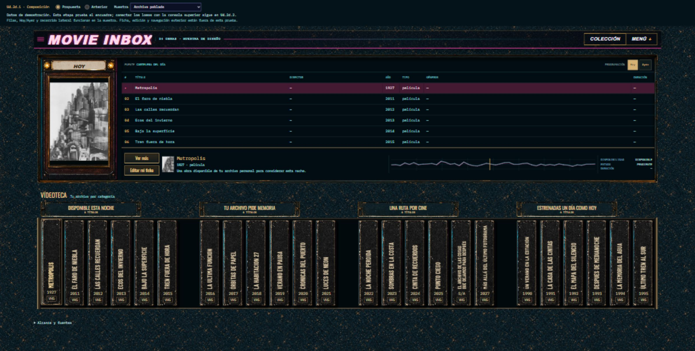

# U4.2d.1 — Reencuadre y una sola consola

2026-09-10. **Propuesta visual entregada; no aplicada a producción.**

**Actualización 2026-09-11:** el comparador ya carga la selección compartida de
U4.2d.2. Filas y VHS actualizan la consola superior; el botón «Probar rotación del
póster» comprueba que la consulta persiste. La descripción del límite d.1 más abajo
es histórica. El encuadre continúa aislado hasta d.3; Propuesta/Anterior compara
layout, no versiones de la interacción. Detalle: `../u4-2d-2-selection.md`.

El owner pidió avanzar con la composición antes de U4.3: evitar que el estante
escape sólo a la derecha y retirar la consola inferior repetida. Se conserva el
material aprobado en U4.2a/b y los componentes actuales de U4.2c.

## Qué se compara

- **Propuesta:** cabecera, cartelera y abertura del estante sobre un mismo frente
  centrado, máximo 2240 px; márgenes laterales equilibrados. Dos retornos finos
  delimitan el estante, sin recuperar la carcasa ni el poste ornamental rechazados.
- **Anterior:** composición de U4.2c con frente de 1744 px, estante extendido a la
  derecha y consola inferior. Ambos modos usan exactamente la misma fixture.
- La consola inferior se oculta sólo en la propuesta. Los lomos conservan altura
  de 308 px y el recorrido permanece dentro de la abertura cuando no caben todos.
- Se conservan seis filas de playlist y sus tamaños de texto. No se escala la Home
  completa para forzarla dentro de 720 px de alto.

En 2482×1254, el frente crece de 1744 a 2240 px; el contenido de `main` baja de
1267,1 a 1039,6 px (unos 228 px recuperados entre consola, separaciones y encuadre).
Los márgenes son aproximadamente 121 px en la propuesta, frente a 361,5 px en el
modo anterior con scrollbar. Los cuatro grupos de seis VHS caben en la propuesta.
En 1920, el frente propuesto mide 1828,2 px; en 1440, 1367,4 px. El desplazamiento
del estante es local, no un desborde horizontal de la página.

## Abrir

Desde la raíz del repositorio:

```powershell
node docs/design/u4-2d-1-composition/serve-preview.mjs
```

El servidor imprime una URL local con puerto libre. La barra superior permite
alternar **Propuesta / Anterior** y probar archivo poblado, títulos largos, imágenes
ausentes y editorial vacía. No requiere instalar dependencias.

Se sirven HTML, CSS, fuentes, imágenes y renderers reales de Home, con datos aislados.
No hay acceso a APIs ni al catálogo personal. La ficha, edición y navegación exterior
están deshabilitadas explícitamente. Los estados personales y 23 títulos son sintéticos;
Metropolis y su imagen se reutilizan de la muestra U4.2b, con atribución en el pie.
El comparador usa el CSS actual del repo: las capturas fijan esta revisión; futuros
cambios de producción también se reflejarán al volver a ejecutarlo.

## Límite de esta entrega

U4.2d.1 es composición, **no selección compartida**. Seleccionar una fila actualiza
la consola superior mediante el renderer actual. Seleccionar un lomo conserva su
estado visual, pero todavía no alimenta esa consola; el laboratorio lo avisa.
El autoplay no corre en la muestra. El componente inferior aún existe en el DOM
para permitir la comparación y sigue existiendo en producción.

Próximas partes:

1. **U4.2d.2:** una selección común para filas y VHS, sin reprogramar la playlist al
   consultar un lomo ni permitir que la rotación del póster pise una selección manual.
2. **U4.2d.3:** llevar el encuadre a Home y consolidar datos, imágenes, créditos,
   estados y acciones en la consola superior; retirar el componente inferior real.
   Verificar teclado, permisos y reflow sin perder información.
3. **U4.3:** integrar visualmente esa consola definitiva, ya sin duplicación.

## Verificación

Comprobación en navegador conectado; capturas de viewport, no montajes:

| Tamaño | Evidencia | Resultado |
| --- | --- | --- |
| 2482×1254 | `proposal-2482.png`, `before-2482.png` | Frente centrado, cuatro categorías completas, una consola visible |
| 1920×1080 | `proposal-1920.png` | Seis filas; tabla 270 px visibles / 270 px de contenido |
| 1440×900 | `proposal-1440.png`, `before-1440.png`, `shelf-1440.png`, `shelf-scrolled-1440.png` | Dos cantos estables, recorrido contenido; flecha siguiente desplaza y habilita anterior |
| 1280×720 | `proposal-1280.png` | Seis filas de 38,5 px; tabla 270/270 px, sin scroll interno vertical |
| 390×844 | `mobile-390.png`, `mobile-shelf-390.png` | Reflow existente, sin desborde de página; flecha de teclado selecciona el lomo siguiente |

Estados: `sparse-1920.png`, `missing-1920.png`, `empty-1920.png`.
Sin errores de consola capturados. Selección de fila comprobada con «El faro de
niebla». La revisión independiente de Impeccable no encontró correcciones materiales
pendientes dentro de d.1. No se ejecutó la suite completa de producción: esta entrega
no modifica sus archivos; el gate funcional de selección pertenece a d.2/d.3 y U4.6.


